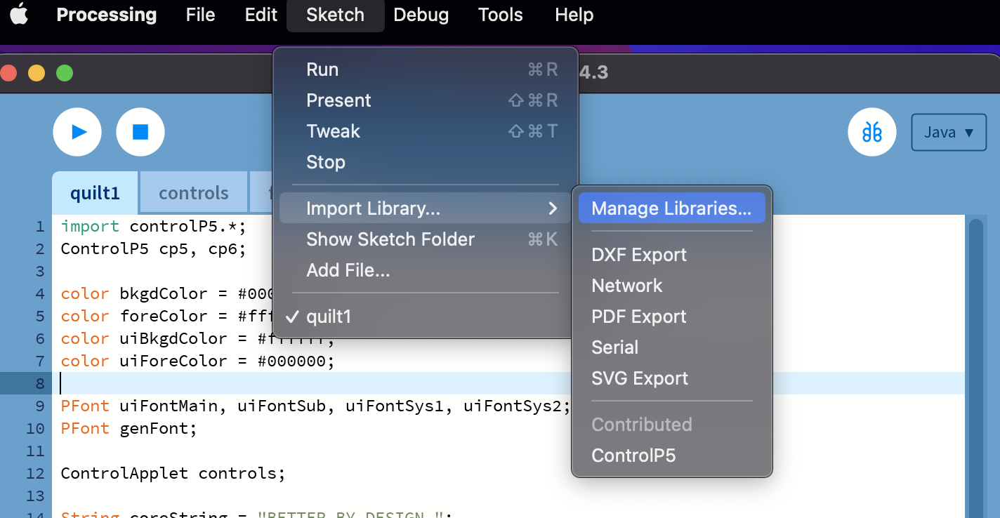
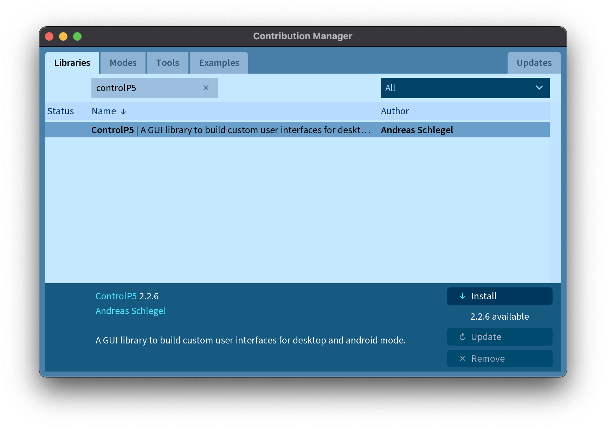
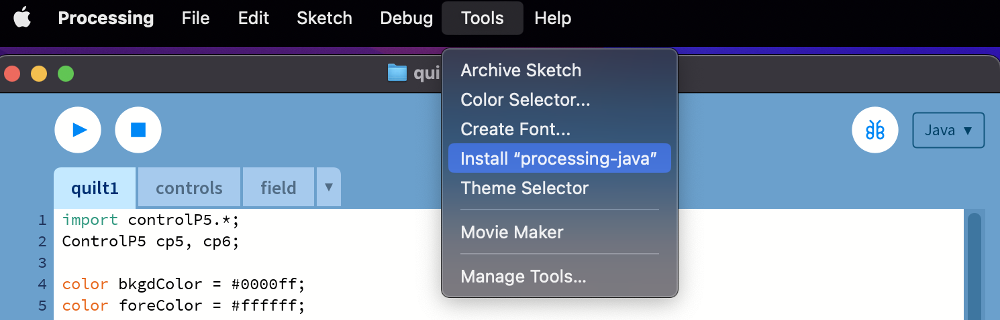

# quilt1

`quilt1` is a generative type program built with the processing engine.

## Installation

`quilt1` may be built with the Processing IDE, or via the command line
with `processing-java`. 

Install Processing with:

```bash
brew install processing
```

Or download the installer at [Processing Download](https://processing.org/download).

`quilt1` requires the GUI library [controlP5](https://github.com/sojamo/controlp5). This library may also be installed with the Processing IDE using the following menu options:




If the library does not install from the Processing IDE, follow the manual installation steps from the [controlP5 installations](https://github.com/sojamo/controlp5)

To build `quilt1` via the cli, you must first install `processing-java` by opening a 
sketch (any sketch or example will work) and clicking the following menu option:



## Build

`quilt1` can be run and built via the Processing IDE. Alternatively, a Makefile has been included for convenience. 

To run `quilt1` via the CLI:
```bash
$ make run
```

To build `quilt1` as an executable:
```bash
$ make
rm -rf /Users/alanm/github/Manual-Quilt/quilt1/build
processing-java --sketch=/Users/alanm/github/Manual-Quilt/quilt1 --output=/Users/alanm/github/Manual-Quilt/quilt1/build --force --export
Finished.
```

## License

tbd